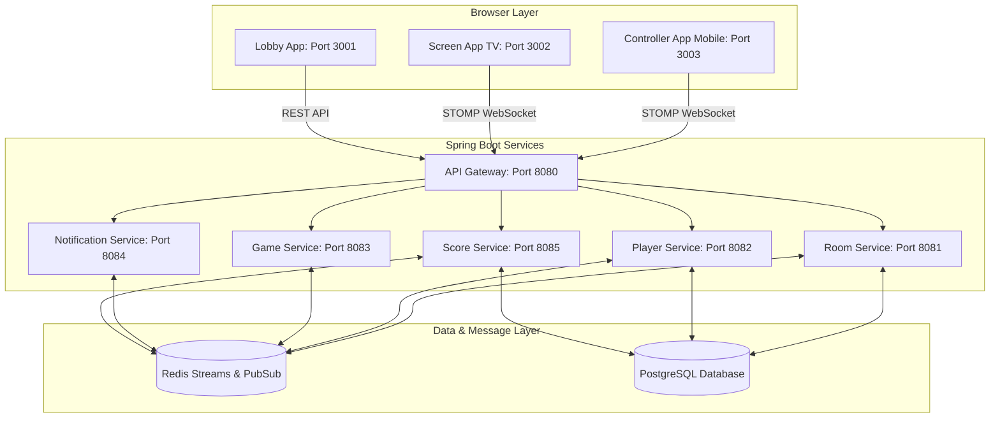

# 🎮 AirConsole Clone

> A decentralized, real-time local multiplayer gaming platform where **browsers act as the TV screen** and **smartphones act as controllers**. No gamepads required.

This project is a high-performance clone of the AirConsole concept. It uses a Spring Boot microservice architecture, Redis Pub/Sub, and real-time WebSockets to synchronize user actions on their mobile web browsers to the main screen in real-time.

---

## 🏗️ Architecture & Technology Stack

The platform is designed as an event-driven system to achieve sub-100ms end-to-end latency for gamepad inputs.



### Key Technologies

*   **Backend Framework**: Spring Boot 3.3.x, Java 21 (configured using Gradle convention plugins)
*   **Frontend Framework**: React 19 + TypeScript + Vite + Turborepo + Tailwind CSS
*   **State & Messaging**: Redis (Streams & Pub/Sub for sub-100ms real-time event dissemination)
*   **Database**: PostgreSQL (persistent storage for players, rooms, and high scores)
*   **WebSockets**: Spring STOMP messaging over WebSocket connections
*   **Observability**: Prometheus + Grafana + Loki + Jaeger (for distributed tracing and logs)

---

## 📂 Project Structure & Directory Links

The repository is organized as a monorepo containing all backend microservices, independent games, and frontend clients. Below are direct links to explore the modules:

*   [Root Makefile](file:///home/spiderman/Development/airConsole/Makefile): Single entry point for operations.
*   [common-lib](file:///home/spiderman/Development/airConsole/common-lib): Shared models, DTOs, domain events, exception handlers, and game engine interfaces.
*   [api-gateway](file:///home/spiderman/Development/airConsole/api-gateway): Spring Cloud Gateway providing unified routing, JWT validation, and rate-limiting.
*   [room-service](file:///home/spiderman/Development/airConsole/room-service): Manages the room lifecycle, joining states, and coordinates player synchronization.
*   [player-service](file:///home/spiderman/Development/airConsole/player-service): Manages player identities, authentication sessions, and automatic reconnect windows.
*   [game-service](file:///home/spiderman/Development/airConsole/game-service): Houses the core game orchestrator and state machine, loading game engines as pluggable libraries.
*   [notification-service](file:///home/spiderman/Development/airConsole/notification-service): Operates as the WebSocket STOMP broker, bridging real-time communication between clients and Redis.
*   [score-service](file:///home/spiderman/Development/airConsole/score-service): Records match results and serves leaderboards.
*   [games/](file:///home/spiderman/Development/airConsole/games): Contains independent game implementations:
    *   [games/snake](file:///home/spiderman/Development/airConsole/games/snake): Cyberpunk-style Neon Snake engine.
    *   [games/trivia](file:///home/spiderman/Development/airConsole/games/trivia): Multiplayer quiz trivia engine.
*   [frontend/](file:///home/spiderman/Development/airConsole/frontend): React frontend workspaces:
    *   [frontend/apps/lobby](file:///home/spiderman/Development/airConsole/frontend/apps/lobby): Catalog browser to select games.
    *   [frontend/apps/screen](file:///home/spiderman/Development/airConsole/frontend/apps/screen): The big TV Screen renderer.
    *   [frontend/apps/controller](file:///home/spiderman/Development/airConsole/frontend/apps/controller): The mobile D-Pad/controller view.
*   [infra/](file:///home/spiderman/Development/airConsole/infra): Docker Compose files for dev and production stacks, plus configuration files for Prometheus, Grafana, Loki, and Nginx.

---

## ⚡ Real-Time Connection & Game Flow

1.  **Lobby Selection**:
    *   The user visits the **Lobby App** (`http://localhost:3001`).
    *   Selecting a game (e.g., *Neon Snake*) redirects the browser to the **Screen App** (`http://localhost:3002/`).
2.  **Room Setup**:
    *   The **Screen App** makes a REST call to the **Room Service** (via Gateway) to create a new room.
    *   The Room Service returns a unique 4-digit room code (e.g., `5829`) and registers it in Redis.
    *   The Screen App renders the room code alongside a QR code.
3.  **Controller Joining**:
    *   Players visit the **Controller App** (`http://localhost:3003`) on their phone and enter the 4-digit room code.
    *   The Controller App registers the player with the **Player Service**, receives a JWT, and sends a join request to the **Room Service**.
    *   The Room Service publishes a `PlayerJoinedRoomEvent` to Redis. The **Notification Service** intercepts this event and pushes it to the Screen App via STOMP WebSockets, updating the lobby list in real time.
4.  **Game Session Start**:
    *   The Screen App sends a start-game event.
    *   The **Game Service** creates a game session, launches the corresponding game engine, and publishes a `GameStartedEvent`.
    *   The Notification Service delivers the event to the Controller App, which dynamically renders the custom touch screen layout for the active game, and to the Screen App, which transitions to the game board canvas.
5.  **Game Loop & Input Sync**:
    *   As players press buttons on the controller, the Controller App publishes key events (`up`, `down`, `left`, `right`) to the Notification Service via a STOMP client.
    *   The Notification Service publishes inputs to Redis. The **Game Service** dequeues inputs, ticks the game state, and posts `GameStateUpdatedEvent` snapshots to Redis.
    *   The Notification Service forwards these updates to the Screen App, causing the canvas to update immediately at 30+ FPS.

---

## 📊 Ports & Access References

### Frontends & Client Entry Points
| Application | URL / Port | Role |
| :--- | :--- | :--- |
| **Lobby Web App** | `http://localhost:3001` | Catalog browser & game selector |
| **TV Screen App** | `http://localhost:3002` | Game display & room host |
| **Controller Web App** | `http://localhost:3003` | Smartphone D-pad remote client |

### Microservices
| Microservice | Port | Database Schema | Primary Role |
| :--- | :--- | :--- | :--- |
| **API Gateway** | `8080` | *None* | Single entry-point, JWT authentication, and routing |
| **Room Service** | `8081` | PostgreSQL | Room state machine, room code generation |
| **Player Service** | `8082` | PostgreSQL | User session identity, JWT issuer |
| **Game Service** | `8083` | Redis | Pluggable game tick orchestrator |
| **Notification Service**| `8084` | *None* | Spring WebSocket STOMP broker hub |
| **Score Service** | `8085` | PostgreSQL | High-scores leaderboard tracker |

### Infrastructure Services
| Service | Local Host Port | UI Credentials |
| :--- | :--- | :--- |
| **PostgreSQL** | `5432` | User: `airconsole` / Pass: `airconsole` / DB: `airconsole` |
| **Redis** | `6379` | *None* |
| **Prometheus** | `9090` | *None* |
| **Grafana** | `3000` | User: `admin` / Pass: `admin` |
| **Loki** | `3100` | *None* |
| **Jaeger** | `16686` | *None* (Open telemetry distributed tracing UI) |

---

## 🚀 Quick Start Guide

### Prerequisites
*   **Java 21 JDK** installed.
*   **Node.js v18+** & **pnpm** installed.
*   **Docker & Docker Compose** installed.

### 1. Launch Infrastructure
From the repository root, start the databases, queues, and observability stack:
```bash
make dev
```
Wait a few seconds for PostgreSQL and Redis to pass healthchecks.

### 2. Build the Project
Compile and package the common library, games, and services:
```bash
./gradlew build
```

### 3. Start Backend Services
Launch all microservices concurrently. We recommend running each in a separate terminal:
```bash
./gradlew :api-gateway:bootRun
./gradlew :room-service:bootRun
./gradlew :player-service:bootRun
./gradlew :game-service:bootRun
./gradlew :notification-service:bootRun
./gradlew :score-service:bootRun
```

### 4. Start Frontend Apps
Navigate to the frontend workspace and launch the Turborepo dev stack:
```bash
cd frontend
pnpm install
pnpm run dev
```
This automatically starts:
*   Lobby: `http://localhost:3001`
*   Screen: `http://localhost:3002`
*   Controller: `http://localhost:3003`

---

## 🛠️ Developer Guide: Adding a Pluggable Game

Games are modular libraries that are dynamic plugins. They run as decoupled packages implementing the standard interfaces defined in `common-lib`.

### 1. Backend Engine Implementation
Create a new Gradle module inside [games/](file:///home/spiderman/Development/airConsole/games). E.g., `games/ping`.

1. Implement [GameEngine](file:///home/spiderman/Development/airConsole/common-lib/src/main/java/com/airconsole/common/engine/GameEngine.java):
   ```java
   package com.airconsole.games.ping;
   import com.airconsole.common.engine.*;
   
   public class PingGameEngine implements GameEngine {
       @Override
       public void initialize(GameContext context) { ... }

       @Override
       public GameSnapshot tick(long frameNumber) { ... }

       @Override
       public void handleInput(GameInput input) { ... }

       @Override
       public boolean isFinished() { ... }
   }
   ```
2. Implement [ControllerLayout](file:///home/spiderman/Development/airConsole/common-lib/src/main/java/com/airconsole/common/engine/ControllerLayout.java) to define the dynamic touch button positions, sizes, and actions sent to the phone screen.

### 2. Frontend Interface
1. Add a rendering component inside the **Screen App** (`frontend/apps/screen/src/components`) using HTML5 Canvas or CSS to draw the updated game state coordinates.
2. The **Controller App** automatically parses the JSON `ControllerLayout` received from the backend at startup, rendering the visual buttons and mapping screen touch events to STOMP action packages.

---

## 💻 Operations Command Reference

Project-wide operations are structured inside the root [Makefile](file:///home/spiderman/Development/airConsole/Makefile):

*   `make dev`: Launches local databases (PostgreSQL, Redis) and logging dashboards.
*   `make build`: Full Gradle packaging and lint check.
*   `make test`: Runs unit tests across all microservices.
*   `make coverage`: Generates JaCoCo test coverage HTML reports.
*   `make docker-build`: Packages services into production OCI docker images.
*   `make infra-down`: Shuts down the dev docker-compose stack.
*   `make clean`: Cleans build directories and deletes persistent docker volumes.

---

## 📜 License
Licensed under the MIT License.
